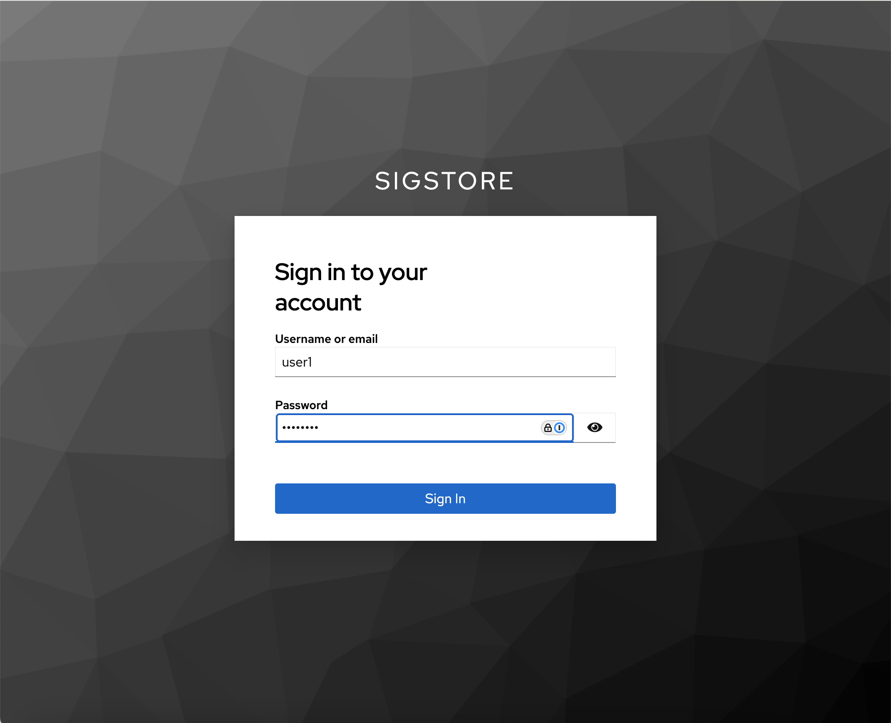

# Validating Signature Using self-managed Rekor & Fulcio instance

First lets add the sigstore helm repo that we will use to install the sigstore stack

```bash
helm repo add sigstore https://sigstore.github.io/helm-charts
helm repo update
```

## Setup keycloak as OIDC provider

Create a client secret 

```bash
export CLIENT_SECRET=this-is-my-secret
envsubst < k8s/realm-cm-template > k8s/realm-cm.yaml

# Create a client secret file to use later
cat << EOF > oidc-client-secret.txt
${CLIENT_SECRET}
EOF
```

Deploy keycloak and import sigstore realm 

```bash
kubectl create ns keycloak && kubectl apply -f k8s/realm-cm.yaml
kubectl apply -f k8s/keycloak.yaml

# Save IP of loadbalancer svc for keycloak frontend
export KEYCLOAK_IP=$(kubectl get svc -n keycloak keycloak -o jsonpath='{.status.loadBalancer.ingress[0].ip}')
```

<!-- Deploy keycloak using Bitnami helm chart with Chainguard images

```bash
helm upgrade --install keycloak -n keycloak bitnami/keycloak \
--create-namespace \
--values ./helm/bitnami-keycloak/keycloak-values.yaml
``` -->

<!-- kubectl create secret generic oidc-client-secret --from-literal=clientSecret=iHTF2wUHCLtXflgnGXwD4ZI3tAkEIHnM -n fulcio-system -->


## Setup Sigstore Stack 

First deploy the sigstore stack using the scaffold helm chart

```bash
helm upgrade --install sigstore sigstore/scaffold \
--values k8s/helm/scaffold-values.yaml \
--create-namespace \
-n sigstore 
 ```

Ensure that all components have been deployed

```bash
kubectl rollout status deployment scaffold-tuf-tuf -n tuf-system
```

Initialize cosign

```bash
cosign initialize --root http://tuf.example.com/root.json --mirror http://tuf.example.com
```

## Deploy Ingress and Setup DNS resolution

```bash
kubectl apply -f https://kind.sigs.k8s.io/examples/ingress/deploy-ingress-nginx.yaml

# Find ExternalIP of Ingress 
INGRESS=$(kubectl get svc -n ingress-nginx ingress-nginx-controller -o jsonpath='{.status.loadBalancer.ingress[0].ip}')

cat <<EOF | sudo tee -a /etc/hosts
${KEYCLOAK_IP} keycloak.example.com
${INGRESS} rekor.example.com
${INGRESS} fulcio.example.com
${INGRESS} tuf.example.com
EOF
```

### Install Docker Mac Net Connect for connecting to exposed services in your KiND cluster

Repo can be found [here](https://github.com/chipmk/docker-mac-net-connect)
```bash
brew install chipmk/tap/docker-mac-net-connect

sudo brew services start chipmk/tap/docker-mac-net-connect

# Run in debug mode 
sudo docker-mac-net-connect 
```

## Sign an artifact 

Using go-discover image

```bash
cosign sign --fulcio-url http://fulcio.example.com \
--oidc-issuer http://keycloak.example.com/realms/sigstore \
--rekor-url http://rekor.example.com \
--oidc-client-secret-file=oidc-client-secret.txt \
--allow-insecure-registry \
ttl.sh/go-discovery:1h
```

If successful you should see the following output

```bash
Generating ephemeral keys...
Retrieving signed certificate...

	The sigstore service, hosted by sigstore a Series of LF Projects, LLC, is provided pursuant to the Hosted Project Tools Terms of Use, available at https://lfprojects.org/policies/hosted-project-tools-terms-of-use/.
	Note that if your submission includes personal data associated with this signed artifact, it will be part of an immutable record.
	This may include the email address associated with the account with which you authenticate your contractual Agreement.
	This information will be used for signing this artifact and will be stored in public transparency logs and cannot be removed later, and is subject to the Immutable Record notice at https://lfprojects.org/policies/hosted-project-tools-immutable-records/.

By typing 'y', you attest that (1) you are not submitting the personal data of any other person; and (2) you understand and agree to the statement and the Agreement terms at the URLs listed above.
Are you sure you would like to continue? [y/N] y
Your browser will now be opened to:
http://keycloak.example.com/realms/sigstore/protocol/openid-connect/auth?access_type=online&client_id=sigstore&code_challenge=h-fV6KBAd6BBYBFlkSinXjpX9Uh2i9w63yYcfcfEFcY&code_challenge_method=S256&nonce=2vHKMBAQavJ5NCtq2LINMqLkx8o&redirect_uri=http%3A%2F%2Flocalhost%3A58276%2Fauth%2Fcallback&response_type=code&scope=openid+email&state=2vHKM7X3dF4BUKDcDE3IFhfYV6d
Successfully verified SCT...
WARNING: Image reference ttl.sh/go-discovery:1h uses a tag, not a digest, to identify the image to sign.
    This can lead you to sign a different image than the intended one. Please use a
    digest (example.com/ubuntu@sha256:abc123...) rather than tag
    (example.com/ubuntu:latest) for the input to cosign. The ability to refer to
    images by tag will be removed in a future release.

tlog entry created with index: 0
Pushing signature to: ttl.sh/go-discovery
```

You will now be redirected in browser to keycloak login page. There are two users (user1 and user2) already setup in keycloak instance. Log in with either (password for both is `password`)



## Validate Signature Locally 

Next lets validate the signature locally using cosign to ensure the image has been properly signed

```bash
cosign verify \
--certificate-oidc-issuer http://keycloak.example.com/realms/sigstore \
--rekor-url http://rekor.example.com \
--allow-insecure-registry \
--certificate-identity-regexp=".*chainguard.dev" \
ttl.sh/go-discovery:1h |jq
```

You should get a successful response below

```json 
[
  {
    "critical": {
      "identity": {
        "docker-reference": "ttl.sh/go-discovery"
      },
      "image": {
        "docker-manifest-digest": "sha256:297f73324167b3e9feedfed1c7563788fdfaeea246ed4f5b46dfa757d131c80b"
      },
      "type": "cosign container image signature"
    },
    "optional": {
      "1.3.6.1.4.1.57264.1.1": "http://keycloak.example.com/realms/sigstore",
      "Bundle": {
        "SignedEntryTimestamp": "MEQCIHiYDKA5BUR20U3geBZiqmSu327nPd4Ri6COBAdjhErkAiAISt+LRR9YHge0tjTqEWrOWDLw2DgO+Icy6nlEB3eRQg==",
        "Payload": {
          "body": "eyJhcGlWZXJzaW9uIjoiMC4wLjEiLCJraW5kIjoiaGFzaGVkcmVrb3JkIiwic3BlYyI6eyJkYXRhIjp7Imhhc2giOnsiYWxnb3JpdGhtIjoic2hhMjU2IiwidmFsdWUiOiJjZWU3Nzk1OWUwZDk4MjVhN2Y4MmVmNWIyMzIwMGIzNjI2MDk3Yzk2MWIyNTE4YTRiYmUxM2FmOWY5Y2ZjNjIwIn19LCJzaWduYXR1cmUiOnsiY29udGVudCI6Ik1FVUNJUUNGNHNUVVp1NEZCVnQ2a09jbzJaUUZRc3hUTkJ0akxGVE9XTVB3UlNCMHVRSWdIdXdod2xhWi9EZ1ZTM1k3SzB3RFpDd0FoWW4vQnExeEt1emcwNTNhdkhzPSIsInB1YmxpY0tleSI6eyJjb250ZW50IjoiTFMwdExTMUNSVWRKVGlCRFJWSlVTVVpKUTBGVVJTMHRMUzB0Q2sxSlNVUkdha05EUVhKMVowRjNTVUpCWjBsVlEyeHpNSGt4WXpFeFJDdGhRMFZEUmxsR056VTJhVVJDY1hGUmQwTm5XVWxMYjFwSmVtb3dSVUYzU1hjS1ptcEZUVTFCYjBkQk1WVkZRbWhOUkZaV1RrSk5VazEzUlZGWlJGWlJVVWxGZDNCRVdWZDRjRnB0T1hsaWJXeG9UVkpaZDBaQldVUldVVkZJUlhjeFZBcFpWelJuVW01S2FHSnRUbkJqTWs1MlRWSlpkMFpCV1VSV1VWRktSWGN3TVU1RVoyZFVWMFo1WVRKV01FbEdUakJOVVRSM1JFRlpSRlpSVVZKRmQxVXhDazU2U1ROT1JFVmFUVUpqUjBFeFZVVkRhRTFSVkVkc2RXUllaMmRTYlRreFltMVNhR1JIYkhaaWFrRmxSbmN3ZVU1VVFUQk5SRkY0VDFSVk1VMXFRbUVLUm5jd2VVNVVRVEJOUkZGNVRVUkJNVTFxUW1GTlFVRjNWMVJCVkVKblkzRm9hMnBQVUZGSlFrSm5aM0ZvYTJwUFVGRk5Ra0ozVGtOQlFWTlZZV2xOU0FveU9TODNRVUkxVEZoRU4xZDNVbXMzUkd0WU1GTkhWMVJXVlZsWFlYRnlORGxrYW05RFJtZEpialF4TTNkbUswNDRLMmQ1VEdnd1ZsTlBTblE1U1hkNUNqVlpiRlZZYW1aMFQwOVlZMUozY25Wdk5FbENhM3BEUTBGWk9IZEVaMWxFVmxJd1VFRlJTQzlDUVZGRVFXZGxRVTFDVFVkQk1WVmtTbEZSVFUxQmIwY0tRME56UjBGUlZVWkNkMDFFVFVJd1IwRXhWV1JFWjFGWFFrSlNRMnBFVlc0MlZtbzBjblZYWlVwdFRVTXdiRUo1UW0xb2EwZFVRV1pDWjA1V1NGTk5SUXBIUkVGWFowSlVjSGg0ZDBWVWRrZ3ZUVGxPV1VsWU1HNUtNV1V6Y2xSYWNYQjZRV2xDWjA1V1NGSkZRa0ZtT0VWSFJFRlhaMUpTTVdNeVZubE5WVUpxQ21GSFJuQmliV1F4V1ZoS2EweHRVbXhrYWtFMVFtZHZja0puUlVWQldVOHZUVUZGUWtKRGRHOWtTRkozVDJrNGRtRXlWalZaTW5oMldWZHpkVnBZYUdnS1lsaENjMXBUTldwaU1qQjJZMjFXYUdKSE1YcE1NMDV3V2pOT01HSXpTbXhOUkhOSFEybHpSMEZSVVVKbk56aDNRVkZuUlV4UmQzSmhTRkl3WTBSdmRncE1NblJzWlZkT2MySXlSbkpNYlZZMFdWY3hkMkpIVlhWWk1qbDBURE5LYkZsWGVIUmplVGw2WVZka2VtUkhPWGxhVkVOQ2FYZFpTMHQzV1VKQ1FVaFhDbVZSU1VWQloxSTVRa2h6UVdWUlFqTkJSbEpEV1dkMWQwWlpkRGxwYTFaTE9VVkphVm96TUZCSk0zVXlORmhKVFdZeWFXaDZibXhCTXl0aEswRkJRVUlLYkdkS1psSjZUVUZCUVZGRVFVVm5kMUpuU1doQlVIWkZWWEpUVldSSmNrRk1kUzlGVkhKa1NFVXdhekJ0V1ROcVlYbEdWbHBYVEdsRmRUbHJkWHBOVkFwQmFVVkJkMDlTT1RaUVdraEZLemhVTVdrM2JEWjFaRnBMUW05dWJuVTVTMUp4ZDJJeFUwdHhNa3RDUzJaa1FYZERaMWxKUzI5YVNYcHFNRVZCZDBsRUNsTlJRWGRTWjBsb1FVMXBLMVZrWm1GME5tUjBZVGRRZDJWd1lrVkNOR3gxUTFoWlJFRjNZVEphT1dSd1VVVnViSFl4TVZsQmFVVkJhRXg2UTBoWFVqSUtRWEoxTm5CSFJFaHBXR0o1YVc5ek5rbGhZVGRoY1hSRmQwMWtiMlJuVm1ObVdtczlDaTB0TFMwdFJVNUVJRU5GVWxSSlJrbERRVlJGTFMwdExTMEsifX19fQ==",
          "integratedTime": 1743796525,
          "logIndex": 0,
          "logID": "6269c1234eedb64f03c7d339e13b7758177c87455273ed997783c119bc22ab9c"
        }
      },
      "Issuer": "http://keycloak.example.com/realms/sigstore",
      "Subject": "user1@chainguard.dev"
    }
  }
]
```

## Apply Cluster Image Policy custom resource

Lastly lets apply a ClusterImagePolicy for our sigstore policy controller to validate signatures for images signed by our `.*@chainguard.dev` user identities 

```bash
cat << EOF > disconnected-keyless-validation.yaml
---
apiVersion: policy.sigstore.dev/v1beta1
kind: ClusterImagePolicy
metadata:
  name: disconnected-keyless-validation
spec:
  images:
    - glob: ttl.sh/**
  authorities:
    - keyless:
        url: http://fulcio.example.com
        identities:
        - issuer: "http://keycloak.example.com/realms/sigstore"
          subjectRegExp: ".*@chainguard.dev" 
      ctlog:
        url: http://rekor.example.com
EOF

kubectl apply -f disconnected-keyless-validation.yaml
```